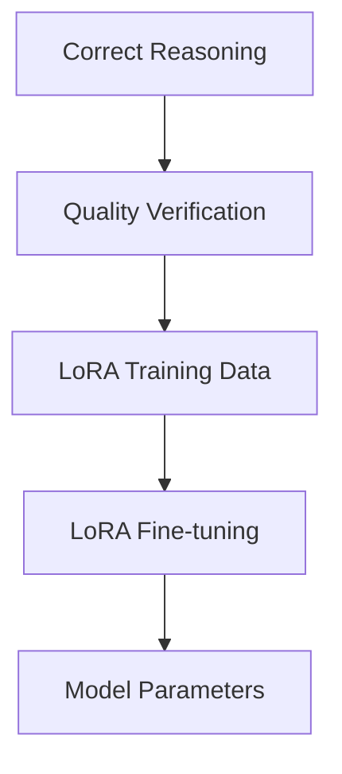
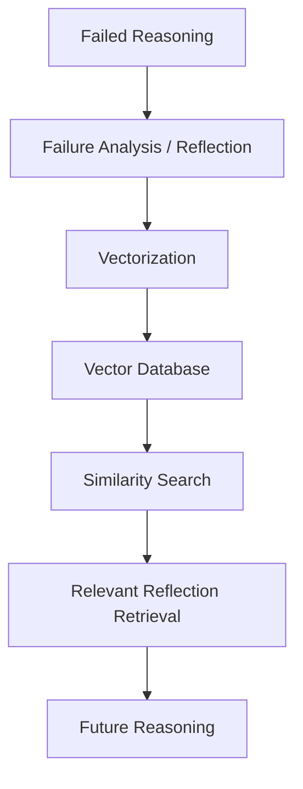
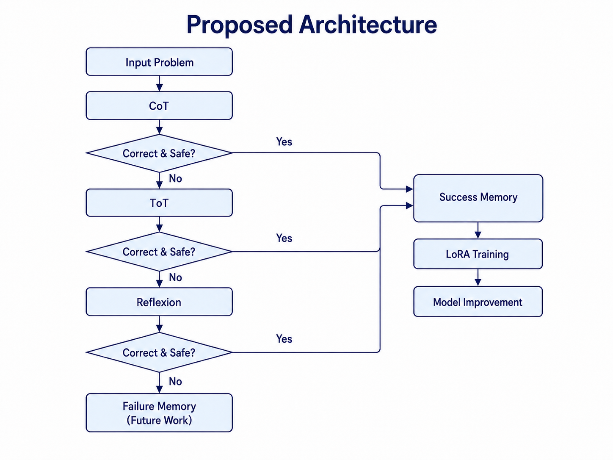

# llm-reasoning-research
探索的推論と反省型自己改善を活用した長期的推論モデルの構築

CoT・ToT・Reflexion・STaR・LoRAを統合したLLMの数理推論性能向上に関する研究

## Overview

大規模言語モデル（LLM）は、文章生成や質問応答で高い性能を示していますが、複雑ステップを必要とする数学的推論では、
・計算ミス
・問題条件の読み違い
・誤った推論方式の選択
によって、もっともらしい誤答を生成する可能性がある

本研究では、

Chain-of-Thought（CoT）
Tree-of-Thoughts（ToT）
Reflexion
STaR
LoRA

による探索・自己修正・学習を行う推論システムを構築の検証

低コストな推論から開始し、必要に応じて高度な推論へ移行する段階的な構成を採用

## Research Background

大規模言語モデル(LLM)は、文章生成や質問応答などで
高い性能を示しています。

一方、複数段階の計算や判断が必要な問題では、
途中で誤った推論を行い、そのまま最終回答を生成する場合があります。

この課題に対して、推論過程を明示するChain-of-Thought（CoT）や、
複数の推論経路を探索するTree-of-Thought（ToT）、
生成した推論を振り返って改善するReflexionなど、
推論時の処理を工夫する研究が行われています。

本研究では、これらの手法を比較するとともに、
探索・評価・振り返り・再学習を組み合わせることで、
より信頼性の高い推論方法を検討しています。

## Research Objective

探索的推論と自己反省を組み合わせ、過去の成功・失敗経験を継続的に利用できるLLM推論モデルを構築すること

### Success Memory

正しく生成され、品質検証を通過した推論を高品質な学習データとして保存し、LoRAによる追加学習に利用する。



### Failure Memory (Future Work)

最後まで修正できなかった推論については、失敗内容と反省情報を外部メモリに保存し、将来の類似問題における推論に活用する。


### Memory Strategy

| Experience | Memory Type | Method | Purpose |
|---|---|---|---|
| Success Experience | Internal Memory | LoRA | 正しい推論をモデルのパラメータに反映 |
| Failure Experience | External Memory | RAG | 過去の失敗や反省を検索し、将来の推論に活用 |


## Proposed Architecture
<p align="center">
  
</p>


## Methods

本研究では、**CoT → ToT → Reflexion → STaR** の順に段階的に推論を行い、必要な場合のみ高コストな推論手法を適用。

### 1. Chain-of-Thought (CoT)

まず、CoTによって推論過程と最終回答を生成。

生成結果が正解かつ品質条件を満たした場合はLoRA学習データとして保存し、条件を満たさない問題のみToTへ移行する。


### 2. Tree-of-Thoughts (ToT)

CoTで解決できなかった問題に対して、複数の推論方針を生成・評価。

有望な候補を選択し、**スコアリング・多数決・LLMによる評価**を用いて最終回答を決定。


### 3. Reflexion

CoT・ToTでも解決できなかった場合、Gold Answerを使用せずに失敗原因を分析。


### 4. STaR

Reflexionによる失敗分析とGold Answerを利用し、正しい推論過程を再生成。

生成された推論に対して品質検証を行い、条件を満たしたデータのみLoRA学習に利用。


### 5. Reasoning Quality Verification

誤った推論を学習データに含めないため、生成された推論過程に対して品質検証を行う。

主な検証項目
- Final Answerと正解データの一致
- Final Answerの形式・重複チェック
- Pythonによる数式の再計算
- 途中計算と最終回答の整合性確認
- 不完全な推論の除外
- LLM Verifierによる追加検証

## Implementation

本研究では、**CoT・ToT・Reflexion・STaRを組み合わせた段階的な推論パイプライン**をPythonで実装。

生成した推論に対して品質検証を行い、**条件を満たした推論のみをLoRA学習データとして利用**。さらに、QLoRAによる追加学習を行い、GSM8Kで性能を評価。

### Reasoning Quality Verification

- Final Answerと正解の一致
- Pythonによる途中計算の検証
- 推論過程と最終回答の整合性確認
- 不完全・不適切な出力の除外
- LLM Verifierによる追加検証


## Experimental Setup

実験では、Meta-Llama-3-8B-Instructをベースモデルとして使用し、GSM8Kを用いて推論性能を評価。

| Item | Setting |
| --- | --- |
| Base Model | Meta-Llama-3-8B-Instruct |
| Dataset | GSM8K |
| Training Split | GSM8K train |
| Evaluation Split | GSM8K test |
| Reasoning Methods | CoT / ToT / Reflexion / STaR |
| ToT Paths | 5 |
| ToT Top-k | 3 |
| Fine-tuning | LoRA / QLoRA |
| Quantization | 4-bit NF4 |
| LoRA Training Data | Correct & Verified Reasoning |
| Evaluation Metric | Accuracy |


## Results

Evaluation Samples: 50 questions

| Method          | Accuracy |
|-----------------|---------:|
| CoT             | 76.0%    |
| ToT             | 74.0%    |
| ToT + Reflexion | 68.0%    |
| Proposed Method | 78.3%    |

## Current Research Status

現在、CoT、ToT、ToT + Reflexion、提案手法の比較評価を行っています。

50問を用いた初期評価では、提案手法が 78.3% と最も高い正答率を示し、CoTの 76.0% を上回りました。

一方で、ToTは 74.0%、ToT + Reflexionは 68.0% となっており、探索や自己反省を追加するだけでは必ずしも性能が向上しないことも確認しています。

現在は、推論経路の選択方法、Reflexionによる修正の有効性、学習データの品質などを分析し、各手法の性能差が生じる原因を検証しています。

今後は評価問題数を増やし、提案手法の有効性をより詳細に検証するとともに、Failure Memoryを用いた長期的な推論改善へ拡張する予定です。

本研究は現在も継続中です。

## Future Work

- 推論経路の評価方法の改善
- 学習データの品質改善
- 推論コストと精度の比較
- 提案モデルの追加評価

## Repository Structure
```text
llm-reasoning-research/
│
├── model_loader.py
│   └── Llama 3 / Tokenizerの読み込み
│
├── generator.py
│   └── LLMテキスト生成
│
├── generate_long_reasoning_train.py
│   ├── CoT
│   ├── ToT
│   ├── Reflexion
│   ├── STaR
│   ├── 推論品質検証
│   └── LoRA学習データ生成
│
├── train_lora_reflexion_star.py
│   └── QLoRAによる追加学習
│
├── gsm8k_lora_eval.py
│   └── LoRAモデルのGSM8K評価
│
├── tot_reflexion_star_train.jsonl
│   └── 品質検証済み推論データ
│
├── architecture.png
│   └── 提案モデルのアーキテクチャ
│
└── README.md

**Planned Extensions**
今後、Failure Memory実装後に以下を追加する予定です。

failure_memory.jsonl

failure_memory/
├── embed_failure.py
├── vector_store.py
└── retrieve_failure.py
```

## References
- Wei et al., *Chain-of-Thought Prompting Elicits Reasoning in Large Language Models*
- Yao et al., *Tree of Thoughts: Deliberate Problem Solving with Large Language Models*
- Shinn et al., *Reflexion: Language Agents with Verbal Reinforcement Learning*
- Zelikman et al., *STaR: Bootstrapping Reasoning With Reasoning*
- Cobbe et al., *Training Verifiers to Solve Math Word Problems*


