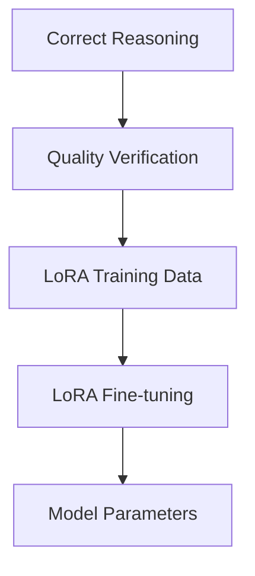
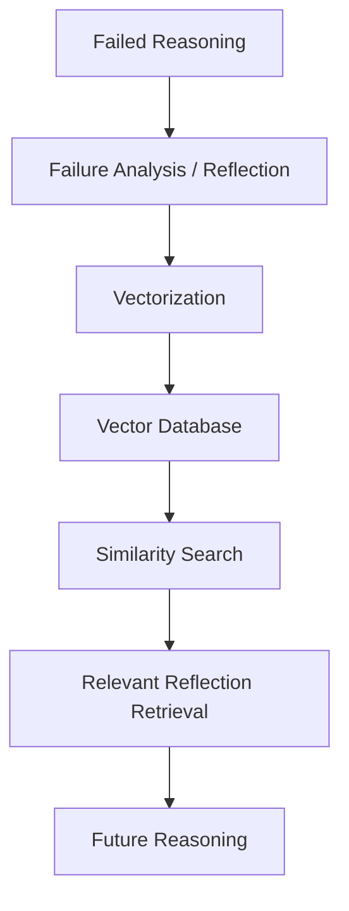

# llm-reasoning-research
探索的推論と反省型自己改善を活用した長期的推論モデルの構築

CoT・ToT・Reflexion・STaR・LoRAを統合したLLMの数理推論性能向上に関する研究

## Overview

大規模言語モデル（LLM）は、文章生成や質問応答で高い性能を示していますが、複雑ステップを必要とする数学的推論では、
・計算ミス
・問題条件の読み違い
・誤った推論方式の選択
によって、もっともらしい誤答を生成する可能性がある

本研究では、

Chain-of-Thought（CoT）
Tree-of-Thoughts（ToT）
Reflexion
STaR
LoRA

による探索・自己修正・学習を行う推論システムを構築の検証

低コストな推論から開始し、必要に応じて高度な推論へ移行する段階的な構成を採用

## Research Background

大規模言語モデル(LLM)は、文章生成や質問応答などで
高い性能を示しています。

一方、複数段階の計算や判断が必要な問題では、
途中で誤った推論を行い、そのまま最終回答を生成する場合があります。

この課題に対して、推論過程を明示するChain-of-Thought（CoT）や、
複数の推論経路を探索するTree-of-Thought（ToT）、
生成した推論を振り返って改善するReflexionなど、
推論時の処理を工夫する研究が行われています。

本研究では、これらの手法を比較するとともに、
探索・評価・振り返り・再学習を組み合わせることで、
より信頼性の高い推論方法を検討しています。

## Research Objective

探索的推論と自己反省を組み合わせ、過去の成功・失敗経験を継続的に利用できるLLM推論モデルを構築すること

### Success Memory

正しく生成され、品質検証を通過した推論を高品質な学習データとして保存し、LoRAによる追加学習に利用する。

### Failure Memory (Future Work)

最後まで修正できなかった推論については、失敗内容と反省情報を外部メモリに保存し、将来の類似問題における推論に活用する。

### Memory Strategy

| Experience | Memory Type | Method | Purpose |
|---|---|---|---|
| Success Experience | Internal Memory | LoRA | 正しい推論をモデルのパラメータに反映 |
| Failure Experience | External Memory | RAG | 過去の失敗や反省を検索し、将来の推論に活用 |

## Proposed Architecture

  

## Implementation
自分が実装したもの

##　Experimental Setup
- Dataset: GSM8K
- Base Model: Llama-3-8B-Instruct
- Evaluation Metric: Accuracy
- Methods:
  - Chain-of-Thought (CoT)
  - Tree-of-Thought (ToT)
  - Reflexion
  - Proposed Method

## Results

Evaluation Samples: 1,000 questions

| Method          | Accuracy |
|-----------------|---------:|
| CoT             | 79.6%    |
| ToT             | 85.9%    |
| ToT + Reflexion | 89.6%    |
| Proposed Method | 86.9%    |

## Current Research Status

現在、CoT、ToT、ToT + Reflexionの比較評価を完了し、
探索と自己修正を組み合わせることで推論性能が向上することを確認しています。

一方、提案モデルについては、現時点では
ToT + Reflexionを上回る性能は確認できていません。

現在は、学習データの品質や推論経路の選択方法などを分析し、
性能低下の原因を検証しています。

本研究は現在も継続中です。

## Discussion
結果から何が分かったか

## Limitations
まだわかっていないこと

## Future Work

- 推論経路の評価方法の改善
- 学習データの品質改善
- 推論コストと精度の比較
- 提案モデルの追加評価

## Repository Structure
コードの説明

## References
- Chain-of-Thought Prompting Elicits Reasoning in Large Language Models
- Tree of Thoughts: Deliberate Problem Solving with Large Language Models
- Reflexion: Language Agents with Verbal Reinforcement Learning
- Training Verifiers to Solve Math Word Problems (GSM8K)

